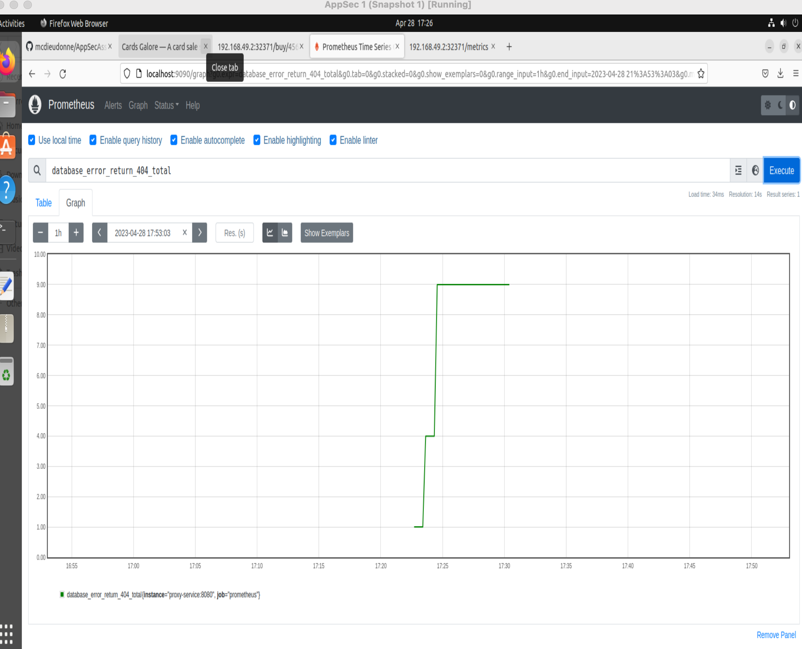

## **Assignment 3 part 3**

#### **Part 3.1: Remove unwanted monitoring**

In views.py file, below code is doing unwanted monitoring as it is also releasing information about password. This code must be removed. Instead of removing it, I commented the code which is as good as removing it.

    # Collect data to ensure good password use.
    if pword not in graphs.keys():
        graphs[pword] = Counter(f'counter_{pword}', 'The total number of '\
          + f'times {pword} was used')
    graphs[pword].inc()
    
#### **Part 3.2: Expand reasonable monitoring.**

Add a Prometheus counter that counts all of the times we purposely return a 404 message in views.py. These lines are caused by Database errors, so you should name this counter database_error_return_404.
 
All changes are in views.py.
 
Created a counter.
 
    graphs['database_error_return_404_counter'] = Counter('database_error_return_404', 'The total number'\
    + ' of 404 returns.')

Then incremented the counter at all places where ever 404 is returned. 

    try:
        prod = Product.objects.get(product_id=prod_num) 
    except:
    	graphs['database_error_return_404_counter'].inc()
    	return HttpResponse("ERROR: 404 Not Found.")

Please check views.py for all the changes.

#### **Part 3.3 Add Prometheus** 

After making changes to views.py for part 3.1 and 3.2, I deleted existing PODs and persistent volume.

    kubectl delete -f proxy/k8
    kubectl delete -f GiftcardSite/k8
    kubectl delete -f db/k8
    minikube ssh
    sudo rm -rf /data/mysql-pv
    logout
    minikube delete

Then I rebuilt everything by running the below commands.

    minikube start
    eval $(minikube docker-env)
    docker build -t nyuappsec/assign3:v0 .
    docker build -t nyuappsec/assign3-proxy:v0 proxy/
    docker build -t nyuappsec/assign3-db:v0 db/
    
    kubectl create secret generic my-secrets \
    --from-literal=mysql_root_password='thisisatestthing.' \
    --from-literal=django_secret_key='kmgysa#fz+9(z1*=c0ydrjizk*7sthm2ga1z4=^61$cxcq8b$l'
    
    kubectl apply -f db/k8
    kubectl apply -f GiftcardSite/k8
    kubectl apply -f proxy/k8
    
    kubectl apply -f GiftcardSite/k8MigrateSeed/django-migrations.yaml
    kubectl apply -f GiftcardSite/k8MigrateSeed/django-seed.yaml
    
I used helm, a package manager for kubernetes that makes it easy to install services like Prometheus.

Commands:

To install helm:

    curl -fsSL -o get_helm.sh https://raw.githubusercontent.com/helm/helm/main/scripts/get-helm-3
    chmod 700 get_helm.sh
    ./get_helm.sh
    
To install prometheus:
`
    helm repo add prometheus-community https://prometheus-community.github.io/helm-charts
    helm repo add stable https://charts.helm.sh/stable
    helm repo update
    helm install prometheus prometheus-community/prometheus

To configure Prometheus, I ran the command "kubectl get configmaps" to first find the configmap.

```plaintext
appsecstudent@appsecstudent-VirtualBox:~/AppSecAssignment3/AppSecAssignment3$ kubectl get configmaps
NAME                      DATA   AGE
kube-root-ca.crt          1      23m
prometheus-alertmanager   1      32s
prometheus-server         6      32s
```

Then I executed the below command to edit configmap for prometheus-server. 

    kubectl edit configmaps prometheus-server

This command opened the configmap in vim. I added -proxy-service:8080 under scrape_configs.

        scrape_configs:
        - job_name: prometheus
          static_configs:
          - targets:
            - localhost:9090
            - proxy-service:8080

With this, prometheus was ready to scrape metrics from the proxy-service:8080 which is our Gift card site.

To verify that monitoring is working correctly and counters are visible in prometheus, I had to do the below.

Generated some 404 erorr by running the website and tried to buy products with non-existent product IDs. For example http://192.168.49.2:32371/buy/3445. This resulted in 404 errors.

Do port forwarding.

    kubectl port-forward service/prometheus-server 9090:80

This will allow our local machine to be able to access the prometheus web ui by visiting localhost:9090.

Then I opened the prometheus web interface and clicked on graph view. Searched for my counter "database_error_return_404" and execute.

Below is the snapshot. You can see counter is incrementing which proves monitoring is working correctly.



I also checked http://localhost:9090/config and found that proxy-service:8080 is present. This means we were able to edit configmap correctly.

```plaintext
scrape_configs:
- job_name: prometheus
  honor_timestamps: true
  scrape_interval: 1m
  scrape_timeout: 10s
  metrics_path: /metrics
  scheme: http
  follow_redirects: true
  enable_http2: true
  static_configs:
  - targets:
    - localhost:9090
    - proxy-service:8080
```

As I used helm to install prometheus, I did not need to create any yaml files manually. helm took care of everything. After making change to configmap, I did save the prometheus yaml file by running the below command.
   
    kubectl get configmap prometheus-server -o yaml > configmap_prometheus_yaml.yaml
    
Checked in this file "configmap_prometheus_yaml.yaml" in the repository.

We can also use prometheus web interface to monitor the other python counters that are listed in views.py


